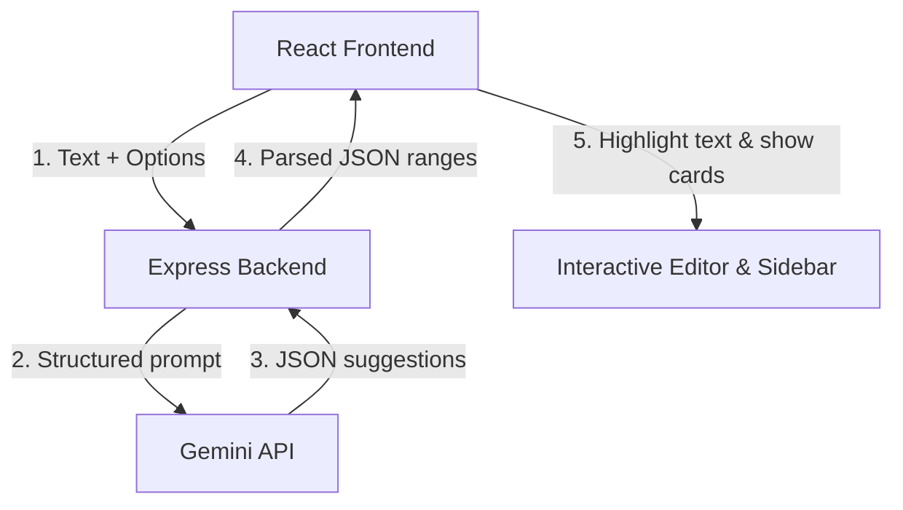

# Implementation Plan: Grammarly-like LLM Grammar & Spelling Checker

This plan outlines the architecture, design, and steps to build **gram-prog** — a premium, high-end spelling and grammar correction assistant powered by the **Gemini API**. It adopts a **Clean Paper & Minimalist** aesthetic, offering a workspace similar to Notion or iA Writer with beautiful typography and interactions.

---

## 🎨 Design & Aesthetic System: "Clean Paper & Minimalist"
*   **Color Palette (Light Mode)**: Warm cream/off-white paper (`#FAF9F6`), soft off-black ink (`#1A1A1A`), warm slate accents (`#6E6E6E`), and very soft, elegant highlighter colors:
    *   🔴 *Spelling errors*: Soft, dotted red underline (`#FFB3B3` background on hover, `#D9383A` text/line)
    *   🔵 *Grammar issues*: Soft, dotted blue underline (`#D0E1FD` background on hover, `#2B6CB0` text/line)
    *   🟡 *Clarity/Style*: Soft, dotted yellow/gold underline (`#FEF3C7` background on hover, `#D97706` text/line)
    *   🟣 *Tone/Politeness*: Soft, dotted purple underline (`#F3E8FF` background on hover, `#7C3AED` text/line)
*   **Color Palette (Dark Mode)**: Warm charcoal/dark ink (`#121212`), muted parchment text (`#E5E5E5`), and subtle highlighters.
*   **Typography**: Clean, professional sans-serif (e.g., `Inter` or `Outfit` from Google Fonts) with spacious line-height (`1.75`) for ultimate readability.
*   **Transitions**: Ultra-smooth micro-animations (transitions on hover, fade-ins for cards, sliding sidebars).

---

## 🧱 Architecture Overview
We will implement a monorepo structure:
*   `/` (Root): Configuration, package.json for orchestrating both frontend and backend.
*   `/backend`: Express.js server running in Node/TypeScript or ES6, proxying requests to Gemini API, performing prompt engineering, and parsing raw output into structured JSON ranges.
*   `/frontend`: Vite + React + TypeScript + Vanilla CSS client application.



---

## 📋 Feature Roadmap

### 1. Interactive Canvas Editor
*   An elegant, spacious editing area.
*   Uses layered rendering or inline span styling to display dotted underlines without disrupting the cursor position.
*   Clicking or hovering on an underlined phrase reveals a tooltip or activates the corresponding card in the sidebar.

### 2. Suggestion Cards Sidebar
*   Minimalist cards that slide in from the right.
*   Displays:
    *   Issue type (Spelling, Grammar, Clarity, Tone)
    *   Original vs. Suggested diff preview
    *   Concise, educational explanation of *why* the suggestion is made
    *   **Accept** (✓) and **Dismiss** (✕) buttons
*   Accepting a card auto-replaces the text in the editor and recalculates remaining ranges.

### 3. AI Tone Rewriter & Polisher
*   A selection widget allowing the user to select any sentence/paragraph and choose a tone preset (e.g., *Professional*, *Casual*, *Academic*, *Empathetic*).
*   The LLM rewrites the text, presenting a before/after split view for the user to insert or copy.

### 4. Writing Statistics & Insights Panel
*   Real-time metrics tracking:
    *   Word count, Character count, Reading time
    *   Flesch-Kincaid Readability Score (or equivalent basic metric)
    *   Detected dominant tone of the overall text (e.g., Confident, Neutral, Worried, Joyful)

### 5. Dual Trigger Mechanism
*   **Auto-check**: A debounced auto-save check triggering 1.5 seconds after the user stops typing.
*   **Manual-check**: A beautiful floating "Analyze Text" button for manual control.

---

## 🛠️ Step-by-Step Implementation Strategy

### Phase 1: Environment & Project Scaffolding
1.  Initialize the project directory, setting up root configurations.
2.  Scaffold Vite with React/TS in `/frontend`.
3.  Scaffold a lightweight Express server in `/backend` with standard dependencies (`dotenv`, `cors`, `@google/generative-ai` or `fetch`).
4.  Configure concurrent start scripts.

### Phase 2: Express Backend & Gemini LLM Pipeline
1.  Implement the `/api/check` endpoint.
2.  Design a robust, structured Gemini System Prompt that forces the model to return correction JSON objects.
    *   *Correction JSON format*:
        ```json
        [
          {
            "id": "c1",
            "start": 12,
            "end": 20,
            "original": "writting",
            "suggestion": "writing",
            "category": "spelling",
            "explanation": "Spelled incorrectly. 'Writing' has a single 't'."
          }
        ]
        ```
3.  Implement robust parsing and error recovery to handle cases where the LLM might omit or offset index counts.
4.  Implement the `/api/rewrite` endpoint for tone changing.

### Phase 3: Minimalist Design & Theme System
1.  Set up the global CSS vars in `index.css` (Clean Paper & Minimalist palette).
2.  Install beautiful typography fonts (Inter/Outfit).
3.  Implement support for high-end CSS transitions and micro-animations.

### Phase 4: Core Frontend Features
1.  Build the layout: beautiful distraction-free editor canvas in the center, sleek floating metrics bar, and a collapsible suggestion cards sidebar.
2.  Develop the text highlighter component that maps server-returned text offsets onto visual highlights.
3.  Implement card interactions (Accept, Dismiss, Hover-focus).
4.  Implement local state management for editor edits to update positions gracefully.

### Phase 5: Advanced Features & Polish
1.  Build the Tone Rewriter modal/popup.
2.  Add metrics calculations.
3.  Polishing the UI, testing edge cases, and ensuring smooth performance.
